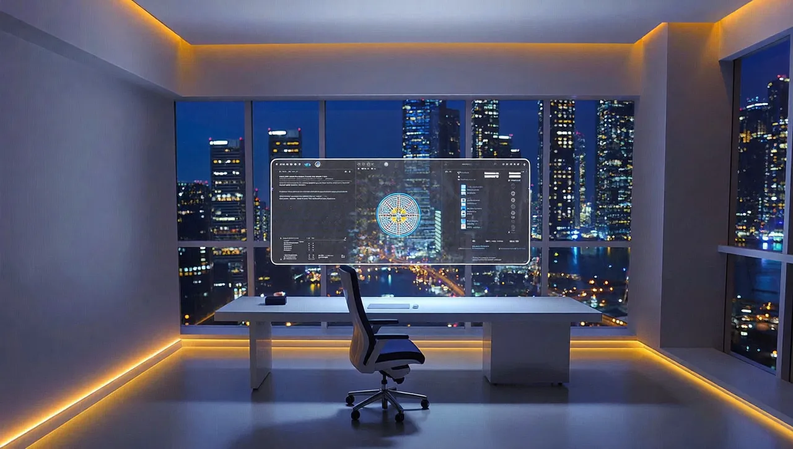

<div align="center">

# Reflow Studio

**Your own AI image and video studio. Bring your own keys.**

A self-hosted web app, REST API and MCP server that generates images and videos with 45+ models (Nano Banana, GPT Image, FLUX.2, Seedream, Kling, Veo, Seedance, Hailuo and more) through fal.ai, Kie.ai and the Higgsfield API. You pay the providers directly at their API prices. No subscription, no credits, no middleman.

[](https://vercel.com/new/clone?repository-url=https%3A%2F%2Fgithub.com%2Freflow-automations%2Freflow-studio-oss&root-directory=apps%2Fweb&project-name=reflow-studio&repository-name=reflow-studio&env=OWNER_EMAILS,REFLOW_SECRET,MONTHLY_BUDGET_USD&envDefaults=%7B%22MONTHLY_BUDGET_USD%22%3A%2210%22%7D&envDescription=Your%20login%20e-mail%2C%20one%20random%20secret%20of%2032%2B%20characters%20and%20a%20monthly%20spend%20cap%20in%20USD.&envLink=https%3A%2F%2Fgithub.com%2Freflow-automations%2Freflow-studio-oss%2Fblob%2Fmain%2Fdocs%2FSETUP.md%23deploy-with-vercel&stores=%5B%7B%22type%22%3A%22integration%22%2C%22integrationSlug%22%3A%22supabase%22%2C%22productSlug%22%3A%22supabase%22%7D%5D)

[Setup guide](docs/SETUP.md) · [MCP tools](docs/MCP.md) · [Add a model](CONTRIBUTING.md) · [Architecture](docs/ARCHITECTURE.md)

</div>

## Made with Reflow Studio

Every image below was generated with Reflow Studio for less than half a cent each.

| | | |
|---|---|---|
|  |  |  |
|  |  |  |
|  |  |  |

Prompts and models: [docs/assets/showcase/manifest.json](docs/assets/showcase/manifest.json).

## Why

Hosted AI studios charge a monthly subscription and sell you credits on top of the same models you can call yourself. Reflow Studio gives you the same workflow on your own free-tier infrastructure:

| | Hosted AI studio | Reflow Studio |
|---|---|---|
| Price | Monthly plan plus credits | Free to run, pay providers per generation |
| Models | Their selection | 45+ models across fal.ai, Kie.ai and Higgsfield API, added as data |
| Cheapest route | No | Picks the cheapest provider per request, with fallback |
| Your data | On their servers | Your Supabase and your storage (Cloudflare R2 or Supabase) |
| AI agents | Limited | Full MCP server: use it from Claude Code, Codex, Cursor or Claude Desktop |
| API | Paid tier | REST API included |
| Spend control | Credits | Cost ledger per generation and a hard monthly budget cap |

## Features

- **Create images and videos** with text, reference images, start and end frames, and model-specific settings. Live cost estimate before you click Generate.
- **Cheapest provider routing.** One model, several providers: the router picks the cheapest configured one and falls back when a provider is down.
- **Library and assets.** Every output is copied into your own storage and stays searchable by prompt and model.
- **MCP server built in.** Let your AI agent generate media: `models_explore`, `generate_image`, `generate_video`, `jobs_wait`, `media_import_url` and more.
- **REST API** with API keys and scopes.
- **Keys stay yours.** Provider keys are encrypted (AES-256-GCM) in your own database and never reach the browser or the MCP channel.
- **Budget guard.** Set a monthly cap in USD; Reflow Studio refuses jobs that would cross it.
- **Owner-only by default.** Only the e-mail addresses you list can sign in, enforced in the app and in the database.

## Quick start

### Option 1: Deploy to Vercel (about 5 minutes)

1. Click **Deploy with Vercel** above. Vercel copies the repo to your GitHub and creates a free Supabase database for you (pick region `eu-west-1` if you are in Europe).
2. Fill in three values:
   - `OWNER_EMAILS`: the e-mail you will log in with.
   - `REFLOW_SECRET`: a random string of 32+ characters. Generate one with `node -e "console.log(require('crypto').randomBytes(32).toString('base64'))"`.
   - `MONTHLY_BUDGET_USD`: your spend cap, for example `10`.
3. When the deploy is done, open your site and go to `/setup` to create your account.
4. Paste a provider key in **Settings → Providers** ([fal.ai](https://fal.ai/dashboard/keys), [Kie.ai](https://kie.ai/api-key) or [Higgsfield API](https://console.higgsfield.ai)).
5. Generate your first image.

The database tables are created automatically during the build. Full guide, including "bring your own Supabase": [docs/SETUP.md](docs/SETUP.md).

### Option 2: Run it locally

```bash
git clone https://github.com/reflow-automations/reflow-studio-oss.git
cd reflow-studio-oss
corepack enable
pnpm install
cp apps/web/.env.example apps/web/.env.local
pnpm dev
```

Set `ENABLE_MOCK_PROVIDER=true` in `apps/web/.env.local` to try the full flow without any provider key or cost.

## Connect your AI agent (MCP)

Create an API key in **Settings → API keys**, then:

```bash
claude mcp add --transport http reflow-studio https://<your-app>/api/mcp --header "Authorization: Bearer rfl_..."
```

Codex, Cursor, Claude Desktop and other clients: [docs/MCP.md](docs/MCP.md).

## What it costs

| Service | Free tier | Notes |
|---|---|---|
| Vercel Hobby | Free | Personal, non-commercial use. Paid client work needs Vercel Pro. |
| Supabase Free | Free | 500 MB database, 1 GB storage, 50 MB per file. Projects pause after a week without activity. |
| Cloudflare R2 (optional) | 10 GB free | Recommended for video. Free egress. |
| Providers | Pay per use | Images from about $0.004, videos from about $0.07. |

## Tech stack

pnpm monorepo: `packages/core` (model catalog as data, provider adapters, router, cost estimation) and `apps/web` (Next.js 16, Supabase, MCP server). Details in [docs/ARCHITECTURE.md](docs/ARCHITECTURE.md).

## Contributing

Adding a model is one data entry in `packages/core/src/catalog/models/`. See [CONTRIBUTING.md](CONTRIBUTING.md). Found a security issue? See [SECURITY.md](SECURITY.md).

## License and disclaimer

[MIT](LICENSE). Built by [Reflow Automations](https://github.com/reflow-automations).

Reflow Studio is not affiliated with or endorsed by Higgsfield AI, fal.ai, Kie.ai or any model vendor. Product names are trademarks of their owners and are used only to describe compatibility. The MCP tool names follow Higgsfield's public MCP vocabulary so existing prompts and agent skills keep working.
